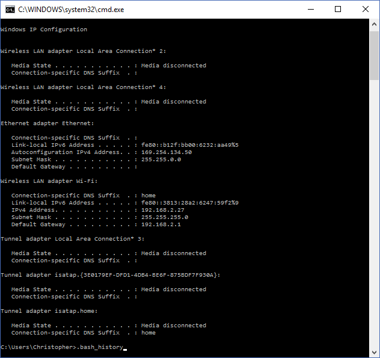
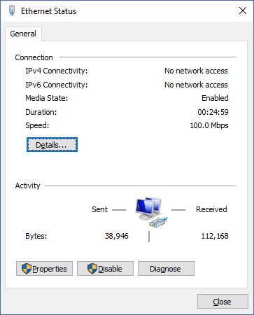
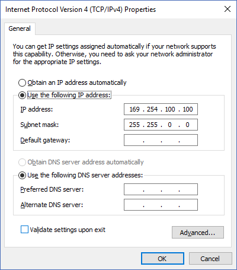

# Ethernet Server
Example code for getting your ethernet shields working. We will be using the Arduino as a server and using a client to make queries to it.

### Summary
1. Attach the shield to your arduino and computer.
2. Find the IP address of your shield OR set a static IP
3. Upload the arduino code to your board. Make sure you change the IP Address
4. Visit the page in the browser OR use one of the clients

### Step 1: Attach the shield to your arduino and computer.
Attach your shield to your Arduino. Plug the ethernet cable into the shield and your computer. Plug the Arduino cable into the board and your computer.

### Step 2: Find the IP address of your shield OR set a static IP
##### Option 1: Finding the IP Address of your shield
Open command prompt, enter ipconfig (Windows) or ifconfig (Linux). Write down this IPv4 address

##### Option 2: Setting a static IP
Control Panel > Network and Internet > Network and Sharing Center > Ethernet

Properties > Internet Protocol Version 4 > Use the following IP addresses
Set the address and subnet masks to whatever you want.

*Note: when uploading code again, you may need to reconfirm this ip. Open the dialog box in the picture above and click OK again*

### Step 3: Upload the arduino code to your board
Open the `.ino` file in the Arduino IDE. Change the IP address at this line: `IPAddress ip(169,254,100,100); //<<< ENTER YOUR IP ADDRESS HERE!!! `
Select the correct board and port (Tools > Board, Tools > Port). Upload it to your Arduino (ctrl + U).

### Step 4: Visit the page in the browser OR use one of the clients
##### Option 1: Use a browser
Open a browser and visit the page corresponding to your ip address (e.g. I would go to 169.254.100.100)
##### Option 2: Use one of the example clients
(open `example.html` in a browser or `python client.py`)
##### Option 3: Any other programming language that supports http requests
Make a GET request to / at 169.254.100.100:80

Regardless of which option you use, you should either have a page with blue text that says "Here is your response" OR receive a string that says
`<html>  
 Here is your response 
 </html>`